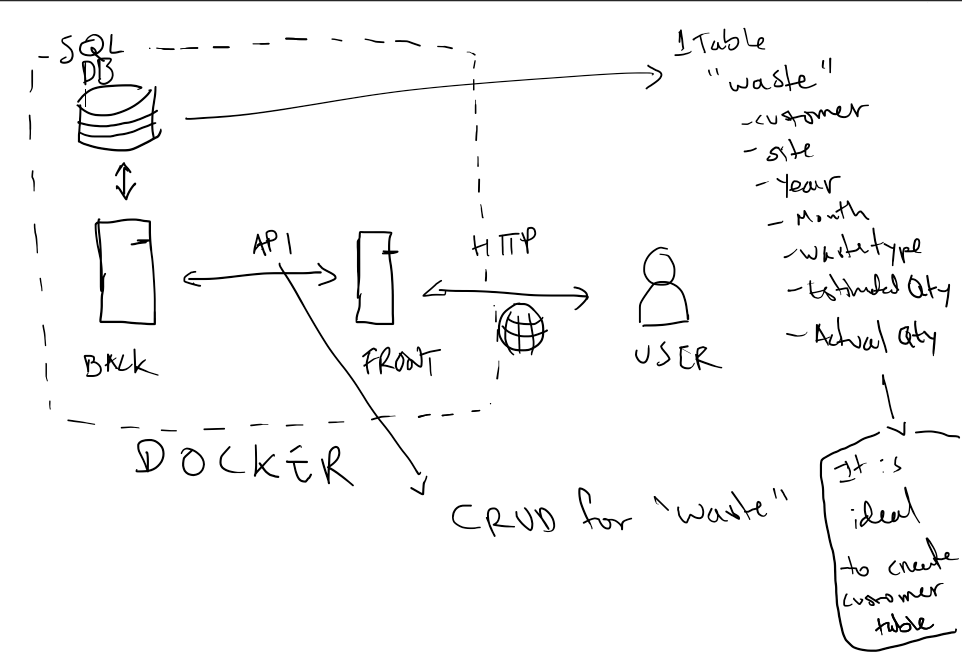

# Podfather Technical Test

## Brief

Included is a data file (pod_data.csv) containing the estimated and actual quantity of waste collected per month for 
several clients.

We would like you to develop a simple application to display the data in a format that can be easily read and understood
by a human.

Please include an element of user input such as a search or filtering.

The requirements are very loosely defined to allow you to design and develop an application which demonstrates the range
of your knowledge. You might choose to focus on frontend, backend or both. Choose a language and approach that best 
shows your skills.

It is not necessarily essential for you to have experience in all of the areas below, but please try to demonstrate your
range of skills where possible:

- Production of high quality, maintainable code which displays a strong knowledge of best practices.
- Use of git – a sensible commit history
- Understanding of data types and their appropriate uses.
- Writing testable code
  - While we do not expect you to write tests in the given timeframe please be aware that testing approaches may be 
    discussed during the follow up interview.

## Project

Laravel (PHP) project with Vue.js frontend.

### How to run

**Requirements**
- [Docker](https://www.docker.com)
- [Composer](https://getcomposer.org) _(can be used through docker, see [dockerhub](https://hub.docker.com/_/composer/) for
  **Basic usage** instructions)_
- [NPM](https://www.npmjs.com)

Instructions to set up and run the project 
1. Clone the project.
2. In the project root folder run `composer update`.
3. In the project root folder run `npm install`.
4. In the project root folder run `./vendor/bin/sail up` (or `./vendor/bin/sail up -d` for a headless process)
5. In the project root folder run `./vendor/bin/sail artisan migrate`
6. In the project root folder run `./vendor/bin/sail artisan db:seed`
7. In the project root folder run `npm run dev`
8. Open the web browser and go to [localhost](http://localhost) 

### Initial Architecture Design sketch

### Current Status

Minimal features for functional display integrated:
- Backend:
  - Database with tables for `customer` and `waste`.
  - Database connection to laravel app
  - Database seeder to seed tables from info on csv file (xls file converted to csv)
  - Model for `customer` and `waste`.
  - Base resource routes for `waste` on `/waste`
  - `Api/WasteController@index` method implemented for collecting all available `waste` items.
  - `Api/WasteController@index` method prepared for receiving parameters for filtering. 
- Frontend:
  - Installed TailwindCSS
  - Installed ChartJS
  - Configured ViteJS
  - Basic design of data visualization page
  - Displayed Chart ( _With lots of room for improvement regarding how data is displayed and/or filtered_ )

Steps to follow to continue development:
- Get values to introduce into UI filtering select items.
- Fix data display on graph. Current display is not appropriate for data type/content.
- Add filtering functionality through REST request to API (Frontend using select items & backend through request body 
  parameters).
- Clean controller to remove unused methods.
- Refactor routes to include them in `api` routes not `web` routes. 
- Consider the introduction of frameworks such as Vue to include web components that make UI design easier and more 
  maintainable.
- Add unit tests for API quality assurance.
- Add table for sites. (_Data abstractions into these tables was thought based on the assumptions that these data 
  might be part of a bigger dataset where customers and sites have more information to then than just their name._)

